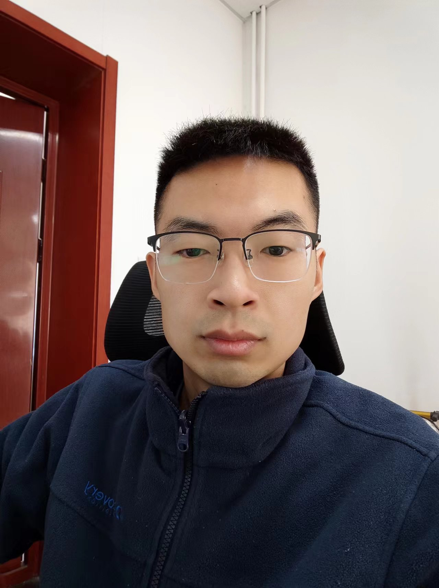

# 🎉欢迎访问王洪珏（Wang-Hongjue）的学术主页
# 邮箱：wanghongjue@bwu.edu.cn
地址：[北京-通州-北京物资学院-信息学院]（https://xxxy.bwu.edu.cn/）

---------------------------------------------------------------
<h3>论文：</h3>
<ul>
	<li>
	<b>Wang, HJ., Hu, ZL., Tao, L. et al. The locatability of Pearson algorithm for multi-source location in complex networks. Sci Rep 13, 5692 (2023). </b></a>
	  <i>We study locating propagation sources in complex networks. We proposed an multi-source location algorithm for different propagation dynamics by using sparse observations. Without knowing the propagation dynamics and any dynamic parameters, we can calculate node centrality based on the character that positive correlation between inform time of nodes and geodesic distance between nodes and sources. The algorithm is robust and have high location accuracy for any number of sources. We study locatability of the proposed source location algorithm and present a corresponding strategy to select observer nodes based on greedy algorithm. All simulations on both model and real-world networks proved the feasibility and validity of this algorithm.</i></li>
	<li><a href="https://iopscience.iop.org/article/10.1088/1367-2630/ac8db3">
	<b>Hongjue W, Fangfeng Z. Locating sources of complex quantum networks[J]. New Journal of Physics, 2022, 24(10): 103025.</b></a>
	  <i>The source location of quantum network is an important basic research in the direction of quantum networks, which has important scientific and application values in the frontier fields include quantum state tomography, quantum computing, quantum communication, etc. In this paper, we conduct innovative research on quantum network source location algorithm and theory. A matrix vectorization technique is used to establish a linear system evolution model for quantum network system, and then a high-precision and high-efficiency source location algorithm based on compressed sensing is proposed for large-scale complex quantum networks. All the results of numerical simulation on various model and real networks show the effectiveness and feasibility of the proposed algorithm.</i></li>
	<li><a href="https://doi.org/10.1016/j.physleta.2021.127184">
	<b>Wang H J ,  Zhang F F ,  Sun K J . An algorithm for locating propagation source in complex networks[J]. Physics Letters A, 2021:127184.</b></a>
	  <i>We study locating propagation source in complex networks. There are already many significant algorithms for locating source, but most of them need the propagation model in advance. In this paper, we propose three new algorithms to accurately locate the source by using only limited observed information without propagation model. The proposed algorithms are based on the defined estimated propagation delay in this paper. We study locatability of algorithms and propose an advisable strategy to select observer nodes based on greedy algorithm. All simulations on both model and empirical networks prove the feasibility and validity of the proposed algorithms.</i></li>
	<li><a href="https://epljournal.edpsciences.org/articles/epl/abs/2020/16/epl20259/epl20259.html">
	<b>Wang H J ,  Sun K J . Locating source of heterogeneous propagation model by universal algorithm[J]. EPL (Europhysics Letters), 2020, 131(4):48001.</b></a>
	  <i>We focus on locating propagation source in complex networks. A novel and simple universal algorithm is proposed to accurately locate source of different heterogeneous propagation models by using only limited observed information without knowing anything about propagation models in advance. An observer nodes selecting strategy is proposed to improve the source locating accuracy of the proposed algorithm. Results simulated on model and empirical networks verify that the proposed source locating algorithm and selecting observer nodes strategy are effective and feasible. </i></li>
	<li><a href="https://doi.org/10.1016/j.physa.2018.09.114">
	<b>Wang H . An universal algorithm for source location in complex networks[J]. Physica A: Statistical Mechanics and its Applications, 2019, 514:620-630.</b></a>
	  <i>We study locating propagation source in complex networks. We proposed an universal algorithm, which can accurately locate source of different propagation dynamics by using sparse observations. Without knowing the propagation dynamics and any parameters, we calculate Spearman centrality based on the character that positive correlation between inform time of nodes and geodesic distance between nodes and source. The algorithm have high location accuracy with low time complexity and can accurately infer initial time of source. All simulations on both model and real-world networks proved the feasibility and validity of this algorithm.</i></li>
	<li><a href="https://arxiv.org/abs/1803.06591">
	<b>Hongjue Wang. Recognizing number of communities and detecting community structures in complex networks, ARXIV, 2018.</b></a>
	  <i>Recognizing number of communities and detecting community structures of complex network are discussed in this paper. As a visual and feasible algorithm, block model has been successfully applied to detect community structures in complex network. In order to measure the quality of the block model, we first define an objective function WQ value. For obtaining block model B of a network, GSA algorithm is applied to optimize WQ with the help of random keys. After executing processes AO (Adding Ones) and RO (Removing Ones) on block model B, the number of communities of a network can be recognized distinctly. Furthermore, based on the advantage of block model that its sort order of nodes is in correspondence with sort order of communities, so a new fuzzy boundary algorithm for detecting community structures is proposed and successfully applied to some representative networks. Finally, experimental results demonstrate the feasibility of the proposed algorithm.</i></li>
	<li><a href="https://doi.org/10.1371/journal.pone.0146727">
	<b>Tao Wang ,Hongjue Wang,Xiaoxia Wang. CD-Based Indices for Link Prediction in Complex Network[J].PLOS ONE, 2016.</b></a>
	  <i>Lots of similarity-based algorithms have been designed to deal with the problem of link prediction in the past decade. In order to improve prediction accuracy, a novel cosine similarity index CD based on distance between nodes and cosine value between vectors is proposed in this paper. Firstly, node coordinate matrix can be obtained by node distances which are different from distance matrix and row vectors of the matrix are regarded as coordinates of nodes. Then, cosine value between node coordinates is used as their similarity index. A local community density index LD is also proposed. Then, a series of CD-based indices include CD-LD-k, CD*LD-k, CD-k and CDI are presented and applied in ten real networks. Experimental results demonstrate the effectiveness of CD-based indices. The effects of network clustering coefficient and assortative coefficient on prediction accuracy of indices are analyzed. CD-LD-k and CD*LD-k can improve prediction accuracy without considering the assortative coefficient of network is negative or positive. According to analysis of relative precision of each method on each network, CD-LD-k and CD*LD-k indices have excellent average performance and robustness. CD and CD-k indices perform better on positive assortative networks than on negative assortative networks. For negative assortative networks, we improve and refine CD index, referred as CDI index, combining the advantages of CD index and evolutionary mechanism of the network model BA. Experimental results reveal that CDI index can increase prediction accuracy of CD on negative assortative networks.</i></li>
	<li><a href="https://www.sciencedirect.com/science/article/abs/pii/S0378437115005233">
	<b>Wang T ,  Wang H ,  Wang X . A novel cosine distance for detecting communities in complex networks[J]. Physica A Statistical Mechanics & Its Applications, 2015, 437:21-35.</b></a>
	  <i>Detecting communities is significant to understand the potential structures and functions of complex systems. In order to detect communities more accurately and reasonably, a novel algorithm is proposed based on cosine distance and core-node in this paper. Cosine distances between nodes are regarded as their similarity measure and network node vectors can be extracted directly from the similarity matrix without calculating eigenvectors. Core-nodes as the initial communities are found by cosine distance threshold and degree threshold. Furthermore, the initial communities are expanded by adding other nodes with the nearest cosine distance to core-nodes. Through changing degree and cosine distance thresholds constantly, the optimal community structure of complex networks can be obtained by optimizing modularity with high accuracy. Experimental results on both real-world and synthetic networks demonstrate the feasibility and effectiveness of the proposed algorithm.</i></li>
</ul>
--------------------------------------------------------------------------------------------------------
<h3>项目：</h3>
<ul>
      <li><td><a href="wang448721577.github.io"><b>项目名称编号等</b></a></td></li>
      <li><td><a href="wang448721577.github.io"><b>项目名称编号等</b></a></td></li>
</ul>

<h3>其他：</h3>
<ul>
      <li><td><a href="https://scholar.google.com/citations?hl=zh-CN&user=ywyxk5wAAAAJ&view_op=list_works&gmla=ABEO0YoM9Bp625IppC9tXp0Ud06He_bk0-HJfdcfhHNrcR9lt2cJpxsdh3des9xfL9wx7hiQ9OmeE5iISBUJGZPZjslv6neM76ziTOiPqz9j43ljeRHHx6Ojwuy4mP0yD_UHgmU"><b>Google学术</b></a></td></li>
      <li><td><a href="https://blog.sciencenet.cn/home.php"><b>科学网</b></a></td></li>
      <li><td><a href="https://github.com/wang448721577"><b>Github</b></a></td></li>
</ul>
----------------------------------------------------------------------------------

## 访问次数：

     

💖🎉😄✨⚡🍵

