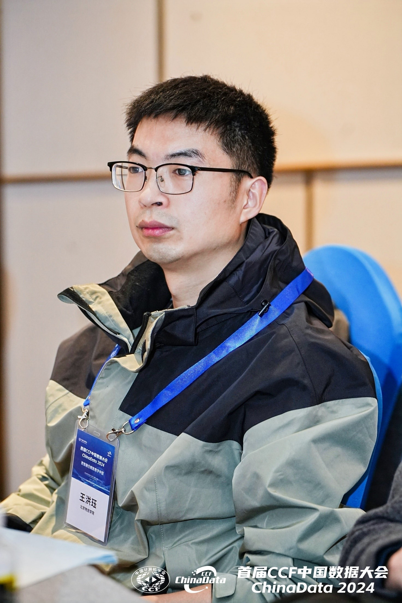

# 欢迎访问王洪珏（Wang Hongjue）的学术主页

# 邮箱：wanghongjue@bwu.edu.cn

# 地址：[中国](https://baike.baidu.com/link?url=BdlunEvIs6v22hr1RfAAfWM8pp4I0lHeipb3Q2vrxpiY7Dtf6mkab_szv_C_20H0Lsqhu9uoOe8J3Y3ddm-WjNfn2wWYX4hGrH6QrfTaGySj5tG2ISxYpplBI4dWo9pjjmC_5HYPUmO8UdZpm_R8t5KVBhucC3eUhpz6jtq0kJi)-[北京](https://baike.baidu.com/item/%E5%8C%97%E4%BA%AC%E5%B8%82/126069?fromModule=lemma_search-box&fromtitle=%E5%8C%97%E4%BA%AC&fromid=128981)-[通州](https://baike.baidu.com/item/%E9%80%9A%E5%B7%9E%E5%8C%BA/5203?fromModule=lemma_search-box)-[北京物资学院](https://www.bwu.edu.cn/)-[计算机与人工智能学院](http://xxxy.bwu.edu.cn/)

<ul>
  <li><a href="https://xxxy.bwu.edu.cn/info/1060/9291.htm"><b>个人简介</b></a></li>
  <li><a href="https://scholar.google.com/citations?hl=zh-CN&user=ywyxk5wAAAAJ&view_op=list_works&gmla=ABEO0YoM9Bp625IppC9tXp0Ud06He_bk0-HJfdcfhHNrcR9lt2cJpxsdh3des9xfL9wx7hiQ9OmeE5iISBUJGZPZjslv6neM76ziTOiPqz9j43ljeRHHx6Ojwuy4mP0yD_UHgmU"><b>Google学术主页</b></a></li>
  <li><a href="https://github.com/wang448721577"><b>Github</b></a></li>
</ul>
---------------------------------------------------------------

<h3>研究领域：</h3>

<ul>
  <li><b>理论方向：</b>复杂网络溯源、系统控制、高阶网络建模、链路预测、社区检测</li>
  <li><b>应用方向：</b>供应链韧性</li>
</ul>

---------------------------------------------------------------

<h3>主讲课程：</h3>

<ul>
  <li><b>本科课程：</b>《最优化方法》、《数据采集与处理》、《商务大数据分析》、《金融证券大数据分析实训》</li>
  <li><b>研究生课程：</b>《复杂系统理论及应用》</li>
</ul>

---------------------------------------------------------------

<h3>代表性论文：</h3>

<ol>
  <li>
    Zhi-Wei Ma, <b>Hong-Jue Wang</b>, Zhao-Long Hu, Xiang-Bin Zhu, Hao Peng, Lin-Yuan Lü, Yi-Zhen Huang, Ming-Lu Li.
    <i>Rumor Source Localization in Social Networks Based on the Propagation Direction of Observers.</i>
    <b>Chaos</b>, 2026.
  </li>

  <li>
    Shuai Xiao, <b>Hongjue Wang</b>, Xia Huang, Zhen Wang.
    <i>Switching event-triggered control for synchronization of delayed memristive neural networks: handling deception attacks.</i>
    <b>Nonlinear Dynamics</b>, 2026.
  </li>

  <li>
    Ping Wang, Xia Huang, Zhen Wang, <b>Hongjue Wang</b>.
    <i>Event-triggered asynchronous control of nonlinear switched systems under actuator saturation.</i>
    <b>International Journal of Systems Science</b>, 2025.
  </li>

  <li>
    Shuai Xiao, Zhen Wang, <b>Hongjue Wang</b>, Yueying Liu, Xia Huang.
    <i>Switching event-triggered control for mean-square exponential synchronization of complex-valued delayed memristive neural networks under hybrid attacks.</i>
    <b>Applied Mathematics and Computation</b>, 2025.
  </li>

  <li>
    Qin-Cheng Yang, <b>Hong-Jue Wang</b>, Zhao-Long Hu, Xiang-Bin Zhu, Jianmin Han, Yi-Zhen Huang, Minglu Li.
    <i>Link prediction with graph convolutional network by integrating local similarity and clustering coefficient.</i>
    <b>Physics Letters A</b>, 2025.
  </li>

  <li>
    Huan-Chen Luo, <b>Hong-jue Wang</b>, Zhao-Long Hu, Kai Yang, Lei Hou, Yi-Zhen Huang.
    <i>Federated learning-based regularized adversarial graph embedding for cross-social network user alignment.</i>
    <b>Chaos, Solitons and Fractals</b>, 2025.
  </li>

  <li>
    <b>Hong-Jue Wang</b>, Zhao-Long Hu, Shu-Yu Shao, Fang-Feng Zhang, Li Tao.
    <i>Locating sources of Szegedy’s quantum network.</i>
    <b>Physical Review E</b>, 109, 014311, 2024.
  </li>

  <li>
    Zhi-Wei Ma, <b>Hong-jue Wang</b>, Zhao-Long Hu, Xiang-Bin Zhu, Yi-Zhen Huang, Faliang Huang.
    <i>DISLPSI: A framework for source localization in signed social networks with structural balance.</i>
    <b>Physics Letters A</b>, 2024.
  </li>

  <li>
    Zhao-Long Hu, <b>Hong-Jue Wang</b>, Lei Sun, Chang-Bing Tang, Minglu Li.
    <i>Source localization in complex networks with optimal observers based on maximum entropy sampling.</i>
    <b>Expert Systems With Applications</b>, 2024.
  </li>

  <li>
    Shuyu Shao, Yang Zhang, <b>Hongjue Wang</b>, Xiaoli Fan.
    <i>Virtual reality-induced motion sickness under autonomous vehicle driving conditions: EEG-based recognition and ANOVA analysis of various driving modes.</i>
    <b>Journal</b>, 2024/2025.
  </li>

  <li>
    <b>Hong-Jue Wang</b>, Zhao-Long Hu, Li Tao, Shuyu Shao, Shi-Zhe Wang.
    <i>The locatability of Pearson algorithm for multi-source location in complex networks.</i>
    <b>Scientific Reports</b>, 13, 5692, 2023.
  </li>

  <li>
    Shui-Lin Peng, <b>Hong-Jue Wang</b>, Hao Peng, Xiang-Bin Zhu, Xiang Li, Jianmin Han, Dandan Zhao, Zhao-Long Hu.
    <i>NLSI: An innovative method to locate epidemic sources on the SEIR propagation model.</i>
    <b>Chaos</b>, 33, 083125, 2023.
  </li>

  <li>
    <b>Wang Hongjue</b>, Zhang Fangfeng.
    <i>Locating sources of complex quantum networks.</i>
    <b>New Journal of Physics</b>, 24, 103025, 2022.
  </li>

  <li>
    <b>Hong-Jue Wang</b>, Fang-Feng Zhang, Kai-Jia Sun.
    <i>An algorithm for locating propagation source in complex networks.</i>
    <b>Physics Letters A</b>, 2021.
  </li>

  <li>
    <b>Hong-Jue Wang</b>, Kai-Jia Sun.
    <i>Locating source of heterogeneous propagation model by universal algorithm.</i>
    <b>EPL</b>, 131, 48001, 2020.
  </li>

  <li>
    <b>Wang Hongjue</b>.
    <i>An universal algorithm for source location in complex networks.</i>
    <b>Physica A</b>, 2019.
  </li>

  <li>
    Tao Wang, <b>Hongjue Wang</b>, Xiaoxia Wang.
    <i>CD-Based Indices for Link Prediction in Complex Network.</i>
    <b>PLOS ONE</b>, 2016.
  </li>

  <li>
    Tao Wang, <b>Hongjue Wang</b>, Xiaoxia Wang.
    <i>A novel cosine distance for detecting communities in complex networks.</i>
    <b>Physica A</b>, 437: 21-35, 2015.
  </li>

  <li>
    Tao Wang, <b>Hongjue Wang</b>, Yunzhu Li.
    <i>Analysis of Cascading Failure Based on a New Load Redistribution Model.</i>
    <b>International Conference on Logistics Engineering, Management and Computer Science</b>，LEMCS 2015, 2015.
  </li>
</ol>

----------------------------------------------------------------------------------

<h3>科研网站：</h3>

<ul>
  <li><a href="https://www.linkresearcher.com/"><b>领研</b></a></li>
  <li><a href="https://swarma.org/"><b>集智俱乐部</b></a></li>
  <li><a href="https://campus.swarma.org/"><b>集智学园</b></a></li>
  <li><a href="https://www.koushare.com/"><b>寇享</b></a></li>
</ul>

----------------------------------------------------------------------------------

💖🎉😄✨⚡🍵
